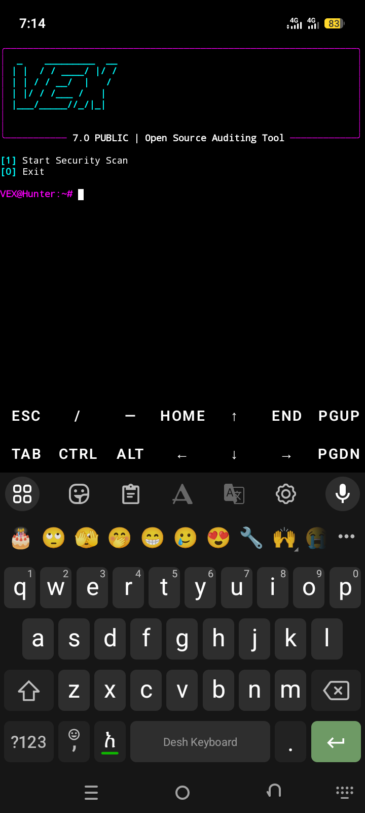
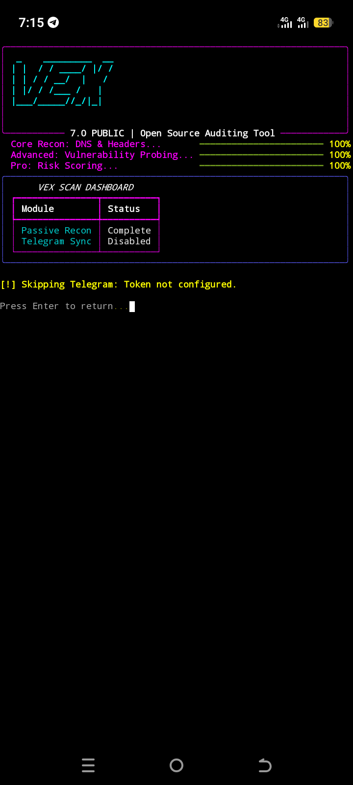

## 📸 Screenshots

<p align="center">
  
  
</p>
# 🛡️ VEX HUNTER v7.0
**Vex Hunter** is a modern security auditing framework designed for Ethical Hackers. It provides a comprehensive suite of tools for vulnerability assessment with a high-end terminal UI.

## ✨ Core Features
- **30+ Security Modules:** Comprehensive scanning logic.
- **Modern Dashboard:** Rich terminal interface with live progress.
- **Telegram Integration:** Get instant scan reports on your phone.
- **Risk Scoring:** Automated vulnerability impact analysis.

## 🚀 Quick Setup

Copy and paste these commands one by one in your terminal:

**1. System Update & Dependencies**
```bash
🔧pkg update && pkg upgrade -y
🔧pkg install python git -y
🔧git clone [https://github.com/etsubgezhagne-tech/etsub-vex.git](https://github.com/etsubgezhagne-tech/etsub-vex.git)
🔧cd etsub-vex && pip install -r requirements.txt
🔧python etsub_vex.py

